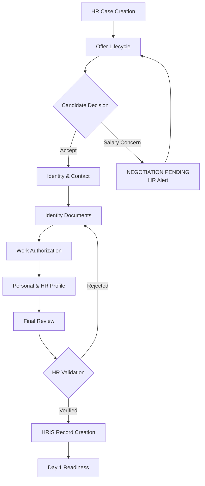

# HR Automator – Product Requirements Document (PRD)

**Version:** 0.4 (Hackathon Final + Data Model)
**Owner:** R2D2
**Last Updated:** February 6, 2026
**Status:** Approved for Implementation

---

## 1. Executive Summary

### 1.1 Product Overview

HR Automator is an AI-orchestrated post-offer automation platform that streamlines the workflow from candidate hire confirmation through preboarding to Day 1 readiness. The system employs a stateless agent architecture with centralized orchestration to ensure auditability, security, and extensibility while eliminating manual coordination across HR systems.

### 1.2 Business Objectives

* Reduce HR administrative workload by 70% in post-offer onboarding processes
* Achieve 100% Day 1 readiness compliance through automated validation gates
* Maintain complete audit trail for all state transitions and human decisions
* Establish extensible architecture for future HR lifecycle automation

### 1.3 Success Metrics

* End-to-end hire case completion time from offer issuance to Day 1 readiness
* Zero candidate data loss across session interruptions and workflow pauses
* 95% document classification accuracy (tracked via mock implementation)
* Demonstrated salary negotiation workflow with proper state preservation

---

## 2. Business Context

### 2.1 Current State Challenges

* Manual tracking of offers, documents, and system provisioning across siloed tools
* Candidate data loss from session interruptions, negotiations, and HR review cycles
* Day 1 readiness failures due to uncoordinated IT, facilities, and HRIS activities
* Inconsistent compliance validation and insufficient audit capabilities

### 2.2 Solution Value Proposition

HR Automator establishes a single source of truth for post-offer workflows through:

* Orchestrated agent execution with strict state management
* Resume-safe candidate interactions with step-level checkpointing
* Human-in-the-loop validation for all high-risk decisions
* Idempotent system integrations preventing duplicate operations

---

## 3. Scope Definition

### 3.1 MVP Implementation (Hackathon Deliverable)

**Core Workflow:**



**Required Capabilities:**

* Hire case initialization with complete candidate context
* Offer management including salary negotiation exception handling
* Structured data collection across 6 mandatory domains
* Mock document intelligence with classification and extraction simulation
* HRIS stub record creation with minimum viable profile
* Automated communication workflows with resume-safe links
* Step-level state management enabling granular progress tracking

### 3.2 Future Phase Requirements

* **Phase 2:** IT Provisioning, Facilities Management
* **Phase 3:** Benefits Enrollment, Authentication Services
* **Phase 4:** Employee Lifecycle Management (leave, transfers, terminations)

---

## 4. Data Model Specification

### 4.1 Mandatory Data Domains

| Domain                       | Status           | Agents Consuming                        | Hard Block Conditions                          |
| ---------------------------- | ---------------- | --------------------------------------- | ---------------------------------------------- |
| **1. Identity & Contact**    | MANDATORY        | Document Intelligence, Compliance, HRIS | Missing fields, unverified email/phone         |
| **2. Identity Documents**    | MANDATORY        | Document Intelligence, Compliance       | Expired/unreadable docs, name mismatch         |
| **3. Work Authorization**    | MANDATORY        | Compliance, Orchestrator                | Missing authorization, refused declarations    |
| **4. Offer Confirmation**    | MANDATORY        | Offer Agent, Orchestrator               | Concern text = negotiation, decline = terminal |
| **5. Personal & HR Profile** | POLICY-DEPENDENT | HRIS, Orchestrator                      | Missing emergency contact (if required)        |
| **6. Final Review**          | MANDATORY        | Orchestrator, Compliance                | Upstream blocks, active holds                  |

### 4.2 Domain 1: Identity & Contact (MANDATORY)

**Fields:**

* Legal full name (as per passport)
* Preferred name (optional)
* Date of birth
* Nationality/citizenship(s)
* Personal email (verification required)
* Phone number (verification required)
* Current residential address
* Country of residence

**Purpose:** Anchor identity for downstream validation and record creation

### 4.3 Domain 2: Identity Documents (MANDATORY)

**Required Uploads:**

* Passport
* National ID (country-specific)
* Visa/residency permit (if applicable)

**Validation Rules:**

* Document classification and extraction (mocked for MVP)
* Name/DOB cross-check against Identity & Contact
* Expiry date validation against start date

### 4.4 Domain 3: Work Authorization & Compliance (MANDATORY)

**Fields:**

* Work location (country + city)
* Right to work confirmation
* Visa status (where applicable)
* Sponsorship requirement (yes/no)
* Policy acknowledgements (privacy, conduct)

### 4.5 Domain 4: Offer Confirmation (MANDATORY)

**Response Options:**

```
Accept → Continue workflow
Decline → Terminal (HR can reissue)
Accept + Concern → NEGOTIATION_PENDING (pause + alert)
```

### 4.6 Domain 5: Personal & HR Profile (MANDATORY WHEN REQUIRED)

**Fields:**

* Marital status (policy-dependent)
* Dependents (policy-dependent)
* Home address confirmation
* Emergency contact (name, relationship, phone)

### 4.7 Domain 6: Final Review & Submission (MANDATORY)

**Candidate Actions:**

* Review all collected data across domains 1-5
* Attest to accuracy
* Submit for HR processing

---

## 5. Architectural Principles

### 5.1 Agent Architecture Mandates

* **Stateless Agent Design:** Agents receive context snapshots, return structured results
* **Single Orchestrator Authority:** Orchestrator exclusively manages persistent state
* **No Direct Agent Communication:** All coordination via shared case state only
* **Human Governance:** Irreversible actions require explicit human authorization

### 5.2 Data Persistence Model

```
Central Case State Database (Supabase):
├── Case-level states (OFFER_DRAFT → READY_FOR_DAY1)
├── Step-level progress (NOT_STARTED|IN_PROGRESS|COMPLETE|BLOCKED)
├── Domain data (JSON objects per domain 1-6)
├── Version history and audit trail
└── Realtime subscriptions for UI sync
```

### 5.3 Security Posture

* No LLM direct database access - Orchestrator mediates all persistence
* API-layer SQL execution with strict input validation
* Token-scoped candidate access preventing cross-case visibility
* Structured agent outputs with schema validation before persistence

---

## 6. User Roles and Permissions

| Role                     | Primary Responsibilities                                                   | System Access                               |
| ------------------------ | -------------------------------------------------------------------------- | ------------------------------------------- |
| **HR Administrator**     | Case creation, data validation, workflow approvals, negotiation resolution | Full case management, state overrides       |
| **Hiring Manager**       | Salary negotiation participation, candidate status visibility              | Read-only case access, notification receipt |
| **Onboarding Candidate** | Form completion, document submission, workflow resumption                  | Single-case tokenized access                |
| **System Orchestrator**  | Workflow coordination, agent invocation, state transitions                 | Internal system component                   |

---

## 7. HRIS Integration Specification

### 7.1 Minimum Viable Employee Profile

| Field          | Source              | Requirement | Format                      |
| -------------- | ------------------- | ----------- | --------------------------- |
| Full Name      | Domain 1 + Domain 2 | Mandatory   | String                      |
| Personal Email | Domain 1            | Mandatory   | Valid Email                 |
| Department     | Hire Case Context   | Mandatory   | String                      |
| Employee ID    | System Generated    | Mandatory   | `EMP-{case_id}-{timestamp}` |
| Tax ID         | Mock Generation     | Mandatory   | `TAX-XXXXXX`                |

### 7.2 State Transition Requirements

```
HRIS_PENDING → HRIS_COMPLETED requires Domains 1-5 complete + HR validation
Idempotency check prevents duplicate employee creation
Employee ID stored in case state for Phase 2 consumers (IT/Facilities)
```

---

## 8. Functional Specifications

### 8.1 Orchestrator Agent Requirements

* Domain-aware state machine (6 mandatory domains + deprioritized)
* Asynchronous agent invocation per domain completion
* Resume-safe routing to first incomplete domain
* Step-level reset (e.g., reset Domain 2 without affecting Domain 1)
* Real-time UI sync via Supabase subscriptions

### 8.2 Offer & Negotiation Agent Requirements

```
Domain 4 processing:
-  ACCEPT → Domain 1 (Identity & Contact)
-  CONCERN → NEGOTIATION_PENDING + HR alert
-  DECLINE → Terminal state
```

### 8.3 Document Intelligence Agent Requirements (Mock)

```
Domain 2 processing:
Input: PDF/JPG/PNG files
Output: Classification + extraction + confidence flags
Error: Wrong doc → Reset Domain 2 only
```

---

## 9. Non-Functional Requirements

### 9.1 Performance

* No candidate loading states > 3 seconds
* Async processing with real-time status updates
* Sub-500ms state transitions

### 9.2 Reliability

* 100% resume capability across all domains
* Idempotent operations across all agents
* Graceful degradation per failed domain

### 9.3 Compliance

* Full audit trail per domain completion
* Version preservation for all candidate inputs
* Explicit HR approval for all hard blocks

---

## 10. Implementation Roadmap

### 10.1 Phase 0 - Foundation (Hackathon MVP)

```
Week 1: Domains 1-6 + Orchestrator + Offer Agent + HRIS stub
Demo Flow: Case → Offer → Domains 1-6 → HR Review → HRIS → Day 1 Ready
```

### 10.2 Future Phases

```
Phase 1: Compliance Agent hardening
Phase 2: IT/Facilities (deprioritized domains)
Phase 3: Benefits/Auth agents
Phase 4: Employee lifecycle
```

---

## 11. Acceptance Criteria

**Hackathon Demo Checklist:**

* [ ] End-to-end flow across all 6 mandatory domains
* [ ] Salary objection handling preserves Domains 1-3 progress
* [ ] Resume-safe across browser close (any domain)
* [ ] Document classification demo (>90% mock accuracy)
* [ ] HRIS stub creation from Domains 1-5 data
* [ ] Async processing (no candidate loading > 3s)

---

## 12. Guiding Principles

**1. Candidate Progress Preservation**
No domain data discarded without explicit human action.

**2. Orchestrator Authority**
Single source of truth for state and domain progression.

**3. Domain Independence**
Individual domain failures don't block orthogonal progress.

**4. Human Governance**
High-risk decisions (HRIS, compliance holds) require explicit approval.

---

**Document Status: APPROVED FOR IMPLEMENTATION**
**Next Steps: Database schema design and agent contract definition**
